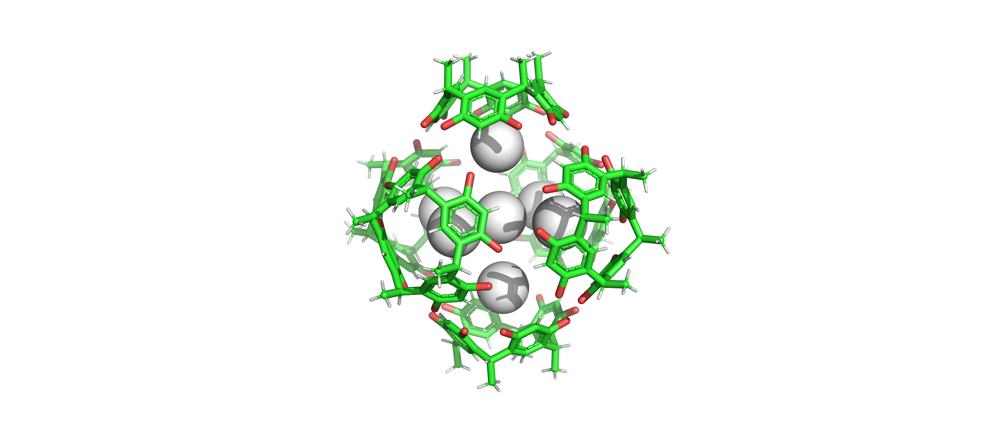
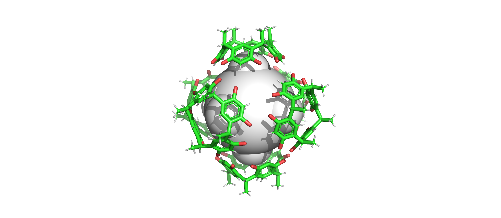
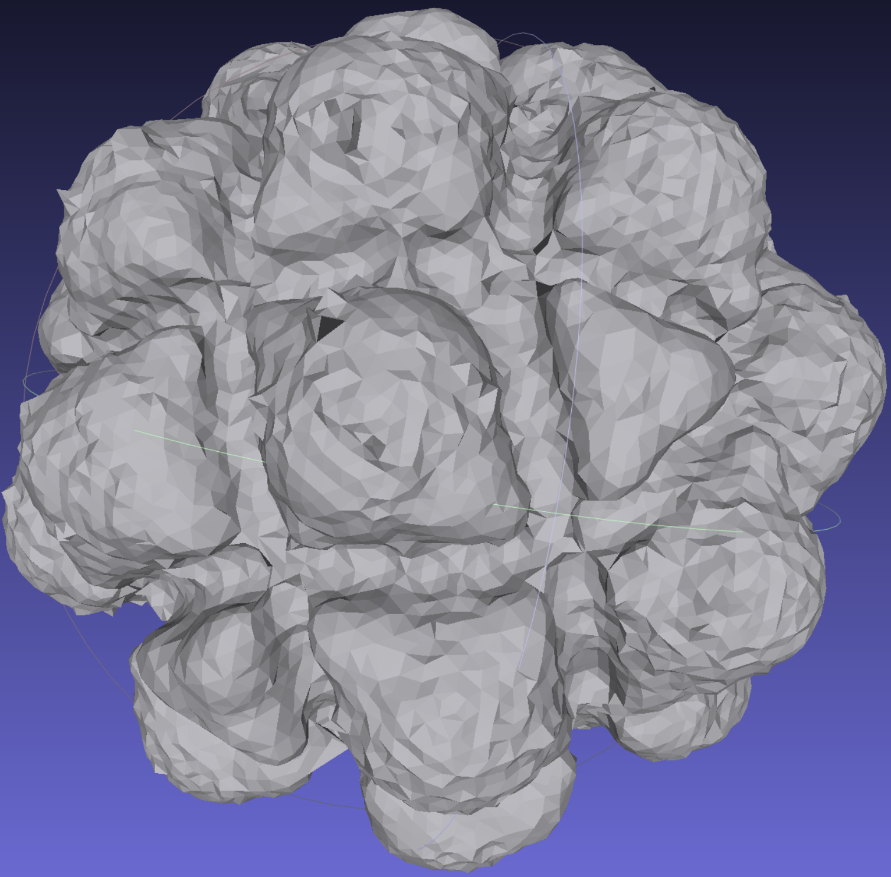
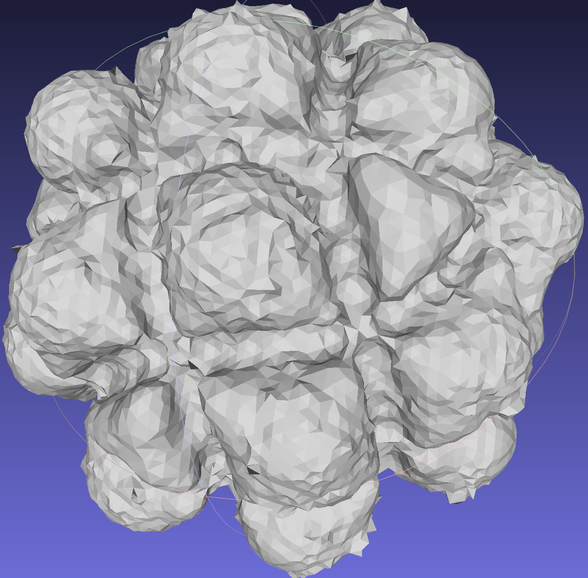

# Molipor-CMCC Comparison Project

This project preserves and compares the cavity calculation results between Molipor (from [J. Chem. Theory Comput. 2019, 15, 787−798](https://pubs.acs.org/doi/10.1021/acs.jctc.8b00764)) and CMCC datasets.

## Workflow Overview

1. **File Conversion Pipeline**:
   - Original PDB files (CMCC dataset) → converted to MOL2 format using PyMOL
   - MOL2 files → V3000 MOL format using `Mol2_to_Mol-v3000.py`
   - V3000 MOL files processed by Molipor to generate cavity points

2. **Output Files**:
   - Molipor generates `voronoi_interior.vtk` files for each molecule (stored in `Molecules_Output`)
   - These files contain Voronoi diagram points inside cavities

3. **Volume Calculation**:
   - VTK → PDB conversion using `convert_vtk2pdb.py` (results in `Cavity_pdb_result`)
   - PyMOL processing:  
     ```pymol
     alter all, vdw = b
     rebuild
     show spheres
     ```

     Before:       After:
   - PDB → WRL conversion (result stored in `wrl_obj_result`)
   - Volume calculation using MeshLab

## Special Case Handling

For the large F2 molecule:
- WRL files had unclosed triangles

- Used Blender for:
  - Mesh completion  
  Before:       Aftet:
  - Volume calculation

## Directory Structure
project_root/  
│  
├── Molecules_Output/ # Molipor output files  
├── Cavity_pdb_result/ # Converted PDB files  
├── wrl_obj_result/ # WRL format files  
├── dataset-1 & dataset-2/ # PDB and Mol type dataset  
├── Mol2_to_Mol-v3000.py # MOL2 to V3000 converter  
├── convert_vtk2pdb.py # VTK to PDB converter  
│  
└── README.md # This file  


## Requirements

- [PyMOL](https://pymol.org/)
- [MeshLab](https://www.meshlab.net/)
- [Blender](https://www.blender.org/) (for F2 special case)
- Python environment for script execution

## References

Original Molipor paper:  
J. Chem. Theory Comput. 2019, 15, 787−798.  
DOI: [10.1021/acs.jctc.8b00764](https://pubs.acs.org/doi/10.1021/acs.jctc.8b00764)